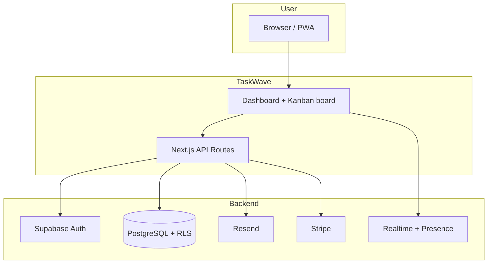

# TaskWave

**TaskWave** is a **Kanban-based project management web app** built for **software teams, startups, and technical project managers** who want to coordinate daily work without the complexity and overhead of traditional enterprise tools (Jira, Azure DevOps, etc.).

> **In short:** create workspaces for your projects, organize work on boards with columns (Backlog → In progress → Done), assign tasks to teammates, and see updates **in real time** — in the browser or as an installable PWA. Start **free**; pay only when you need email invites, attachments, API access, or advanced integrations.

**Live demo:** [taskwave-rust.vercel.app](https://taskwave-rust.vercel.app)

---

## Table of contents

- [What TaskWave is for](#what-taskwave-is-for)
- [Who it is for](#who-it-is-for)
- [Problems it solves](#problems-it-solves)
- [Concrete use cases](#concrete-use-cases)
- [How it works (conceptual model)](#how-it-works-conceptual-model)
- [Typical user flow](#typical-user-flow)
- [Full feature list](#full-feature-list)
- [Plans and pricing](#plans-and-pricing)
- [Privacy and security](#privacy-and-security)
- [Technical architecture](#technical-architecture)
- [Local setup](#local-setup)
- [Deploy](#deploy)
- [Tests and documentation](#tests-and-documentation)

---

## What TaskWave is for

TaskWave **centralizes your team’s work status** in one visible, up-to-date place. Instead of asking “where are we?” on Slack, updating a Google Sheet, or opening tickets in ITIL-style systems, TaskWave offers:

1. **A Kanban board** where each task is a card you move between columns (workflow states).
2. **Separate workspaces** for different projects, clients, or squads.
3. **Live collaboration** — when a teammate moves a task or adds a comment, you see it instantly without reloading.
4. **Notifications** when you are assigned, when someone comments, or when a task changes column.
5. **Accounts and permissions** — each member has a role (admin or member); admins manage invites and settings.

It is not an ERP, not a CRM, and not a wiki. It is a **daily operational tool**: open the board in the morning, see what is queued, move cards as you ship, end the day with an updated “Done” column.

### What TaskWave **does not** do (by design)

- Multi-level workflows with dozens of mandatory states and hierarchical approvals
- Built-in time tracking or billable hours
- Enterprise Gantt charts or advanced capacity planning
- Fully replacing Jira in organizations with thousands of users and ISO-certified processes

TaskWave focuses on **speed, clarity, and zero friction** — ideal for teams that prefer *shipping* over *endless configuration*.

---

## Who it is for

| Profile | How they use TaskWave |
|---------|------------------------|
| **Developer / Tech lead** | Boards for sprints or features; assignee on every task; realtime sync during pairing or review |
| **Project manager** | Kanban view for stand-ups; filters by priority and assignee; due dates (Pro) and activity timeline |
| **Founder / startup** | Workspace per product; Free plan to start; upgrade to Pro as the team grows |
| **Freelancer with clients** | Separate workspaces per client; guest link (Business) to share read-only progress |
| **Remote team** | Presence (“N online” on the board), notifications, email invites, same state everywhere |

---

## Problems it solves

| Without TaskWave | With TaskWave |
|------------------|---------------|
| “Who is working on what?” → repeated chat questions | Assignee visible on every card; filter by person |
| Project status scattered across Slack threads | One board = one source of truth |
| Two people edit the same list and overwrite each other | Supabase Realtime: instant updates |
| Free tools are limited or enterprise tools are expensive | Generous Free; Pro/Business only when you need integrations |
| Privacy ignored in free SaaS | IP opt-out, GDPR export, 2FA, cookie consent built in |

---

## Concrete use cases

### 1. Weekly dev team sprint (5 people)

- The tech lead creates workspace **“Product Alpha”** and board **“Sprint 12”** with columns `Backlog | In progress | Review | Done`.
- Import or create tasks from a Scrum template.
- Assign cards to developers; each drags theirs to **In progress** and then **Done** at end of day.
- The PM opens the board during stand-up: no slides to update — the board *is* the stand-up.

### 2. Lightweight bug tracker

- Board with columns `Reported | Triaged | Fixing | Verified | Closed`.
- High/medium/low priority on cards.
- Task comments for reproduction notes (Pro).
- Notify the developer when a bug is assigned to them.

### 3. Onboarding a new member

- Admin sends a **workspace invite** (Pro+); the new user accepts at `/invite/[token]`.
- Onboarding wizard on first login: create workspace, first board, first task.
- Command palette `⌘K` to discover navigation and shortcuts.

### 4. CI pipeline integration (Business)

- Outbound webhook on “task moved to Done” → calls an internal endpoint or Slack incoming webhook.
- REST API v1 to create/update tasks from scripts or GitHub Actions.
- Audit log to track who changed what.

---

## How it works (conceptual model)

TaskWave organizes data in a simple hierarchy:

```
Account (registered user)
  └── Workspace          ← e.g. "Acme Corp", "Side project"
        ├── Members      ← admin | member
        ├── Board        ← e.g. "Sprint 12", "Bug backlog"
        │     ├── Column     ← e.g. "To Do", "Doing", "Done"
        │     │     └── Task       ← title, priority, assignee, due date, comments, attachments
        │     └── ...
        └── Settings     ← webhooks, custom fields, audit (Business)
```



Every **task** lives in a **column** on a **board** inside a **workspace**. Permissions are enforced at the database level with **Row Level Security (RLS)**: users only see workspaces they belong to.

---

## Typical user flow

1. **Sign up** → `/register` (email + password, Supabase Auth)
2. **Onboarding** → create first workspace and board (wizard)
3. **Dashboard** → `/dashboard` — workspace list, boards, pending invites, team panel
4. **Board** → `/workspace/[id]/board/[boardId]` — Kanban drag-and-drop, filters, timeline, presence
5. **Task detail** → side sheet: edit title, priority, assignee, comments, attachments
6. **Account settings** → profile, theme, notifications, **privacy** (opt-out, export, delete), **security** (password, 2FA)
7. **Upgrade** → `/pricing` → Stripe Checkout → Pro/Business plan synced to `profiles.plan`

---

## Full feature list

### Workspace and team

- Multiple workspaces (limit per plan)
- **Admin** / **member** roles
- Email invites with token (`/invite/[token]`) — Pro+ (see [email without a custom domain](docs/EMAIL_AND_DOMAINS.md))
- Remove members, change role, leave workspace
- Workspace accent color (Pro+)
- Private workspaces (Business)

### Kanban board

- Standard or custom columns (Pro+)
- Smooth **drag-and-drop** between columns
- Templates: classic Kanban, Scrum, bug tracker
- Filters by priority and assignee
- **Timeline** activity view
- **Presence**: “N people online” (Supabase Presence)
- Read-only guest link with expiry (Business)

### Tasks

- Title, description, priority (high/medium/low)
- Assignee (workspace member)
- `due_date` (Pro+)
- Comments with notifications (Pro+)
- Attachments on Supabase Storage (Pro: 25 MB, Business: 100 MB)
- Workspace custom fields — text, number, select (Business)

### Realtime and notifications

- **Supabase Realtime** on the board: create/update/delete tasks and columns
- In-app notification inbox (assignment, comment, move)
- Optional emails via **Resend** (toggle per type in settings)
- Workspace activity feed

### Productivity

- **Command palette** (`⌘K` / `Ctrl+K`)
- Guided onboarding on first visit
- **PWA** — manifest, service worker, installable
- Dark / light / system theme

### Business and integrations

- **REST API v1** — workspaces, boards, tasks, members (Bearer API key)
- **API keys** per workspace — generate and revoke
- **Outbound webhooks** — task events with HMAC signature (`X-TaskWave-Signature`)
- **Audit log** — critical actions + CSV export
- **SSO/SAML** — on request (placeholder `/api/sso/status`)

API documentation: [`/docs`](https://taskwave-rust.vercel.app/docs)

### Public site

| Page | Purpose |
|------|---------|
| `/` | Landing — value proposition and board preview |
| `/features` | Product-style feature page (scroll animations) |
| `/pricing` | Free / Pro / Business plans + FAQ |
| `/about` | Story, principles, stack, product vision |
| `/blog` | Articles from `content/blog/*.md` |
| `/privacy`, `/terms` | Legal documents |
| `/privacy/opt-out` | IP tracking opt-out (anonymous + email) |
| Header **Contact us** | Form → `POST /api/contact` → Resend |

---

## Plans and pricing

| | **Free** | **Pro** €12/mo | **Business** €29/mo |
|---|:---:|:---:|:---:|
| Workspaces | 3 | ∞ | ∞ |
| Members / workspace | 5 | 20 | ∞ |
| Boards / workspace | 3 | ∞ | ∞ |
| Kanban + realtime | ✓ | ✓ | ✓ |
| Custom columns | — | ✓ | ✓ |
| Due dates, comments, attachments | — | ✓ (25 MB) | ✓ (100 MB) |
| Email invites | — | ✓ | ✓ |
| Analytics + CSV export | — | ✓ | ✓ |
| API keys + REST API | — | — | ✓ |
| Webhooks + audit log | — | — | ✓ |
| Guest link | — | — | ✓ |
| SSO/SAML | — | — | on request |

**Stripe** Checkout (test mode in development). Billing portal for upgrade/downgrade/cancellation.

---

## Privacy and security

TaskWave treats privacy and security as part of the product:

- **IP opt-out** — public page, account toggle, cookie, GPC/DNT; IP never stored in plain text (SHA-256 hash + `PRIVACY_IP_SALT`)
- **Cookie consent** — banner; sync preferences when logged in
- **GDPR** — JSON export (`GET /api/profile/export`), delete account (`POST /api/profile/delete-account`)
- **2FA TOTP** — Supabase MFA in Settings → Security
- **Rate limiting** — invite, opt-out, delete account, contact form
- **CSP** + security headers (`X-Frame-Options`, `Referrer-Policy`, …)
- **PostgreSQL RLS** — every table protected per user/workspace; plan limits enforced server-side (migration 014)

Operational details: [`docs/BACKUP.md`](docs/BACKUP.md), [`docs/MONITORING.md`](docs/MONITORING.md), [`docs/EMAIL_AND_DOMAINS.md`](docs/EMAIL_AND_DOMAINS.md)

---

## Technical architecture

| Layer | Technology |
|-------|------------|
| Frontend | Next.js 14 (App Router), React 18, TypeScript, Tailwind, shadcn/ui, Framer Motion |
| Auth & DB | Supabase — PostgreSQL, Auth, Realtime, Storage |
| Payments | Stripe Checkout + Customer Portal + webhooks |
| Email | Resend (auth, invites, opt-out, contact) |
| Deploy | Vercel (project `taskwave`) |
| E2E | Playwright |

```
src/
├── app/                 # Pages + API routes
│   ├── (dashboard)/     # Authenticated area
│   ├── (auth)/          # Login, register, reset
│   ├── api/             # Internal REST, v1, Stripe, privacy
│   └── about|features|pricing|blog|privacy|terms
├── components/          # UI, workspace panels, marketing
├── hooks/               # Realtime, presence
├── lib/                 # Supabase, data layer, plans, privacy, webhooks
content/blog/            # Markdown articles
supabase/migrations/     # SQL schema 001–018
e2e/                     # Playwright tests
docs/                    # Backup, monitoring, email & domains
```

**Legacy backend:** `backend/` (Django) is **deprecated** — not used in production. See [`backend/DEPRECATED.md`](backend/DEPRECATED.md).

---

## Local setup

```bash
git clone https://github.com/niccolopiccioli/taskwave.git
cd taskwave
npm install
cp .env.example .env.local   # fill Supabase, Stripe, Resend, PRIVACY_IP_SALT
npm run dev                    # http://localhost:3000
```

### Supabase

- Project: `lcubcugivegahjsbmepy` (eu-west-1)
- Apply migrations in `supabase/migrations/` (001 → 018)
- Auth → URL: `http://localhost:3000/auth/callback` (+ production URL)

### Stripe (test)

```bash
stripe listen --forward-to localhost:3000/api/stripe/webhook
# Test card: 4242 4242 4242 4242
```

Full environment variables: [`.env.example`](.env.example)

---

## Deploy

```bash
vercel deploy --prod
```

- **Vercel project:** `taskwave`
- **Production URL:** [taskwave-rust.vercel.app](https://taskwave-rust.vercel.app)
- Set `NEXT_PUBLIC_APP_URL=https://taskwave-rust.vercel.app` on Vercel
- **No custom domain?** See [docs/EMAIL_AND_DOMAINS.md](docs/EMAIL_AND_DOMAINS.md) — use **Copy link** for invites; buy a domain only if you need automatic email

---

## Tests and documentation

```bash
npm run test:e2e
npx playwright install   # first run
```

Tests cover landing, pricing, blog, privacy opt-out, auth redirects, and board.

---

## Contact

- **Site:** [taskwave-rust.vercel.app](https://taskwave-rust.vercel.app)
- **Form:** “Contact us” button in the site header
- **Docs:** [GitHub repository](https://github.com/niccolopiccioli/taskwave)

---

*TaskWave — Kanban for teams that ship.*
